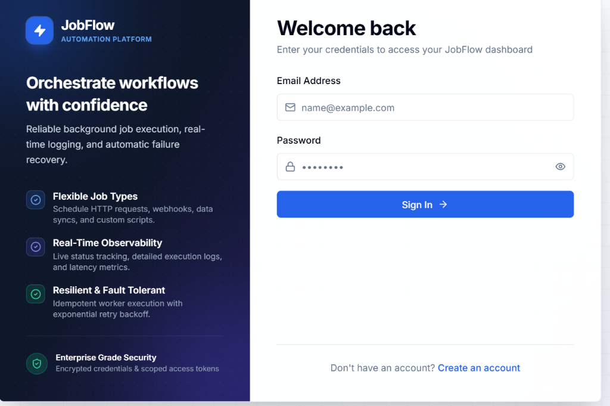
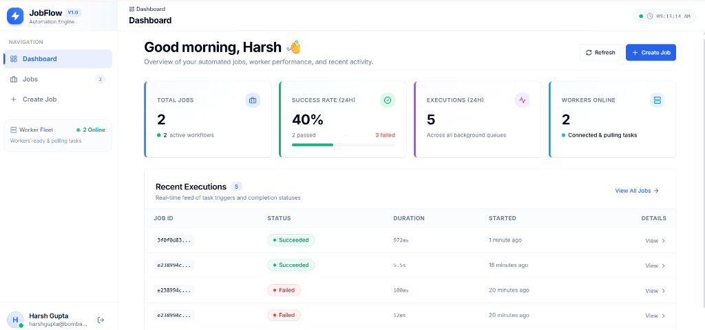
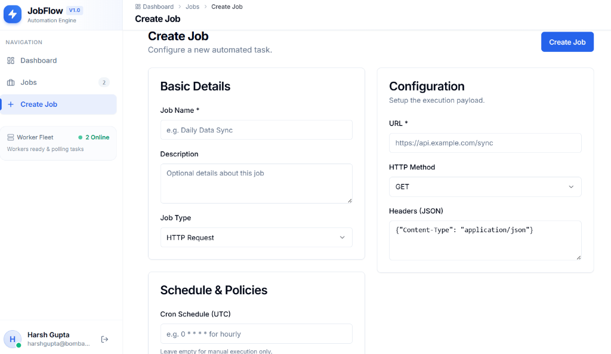
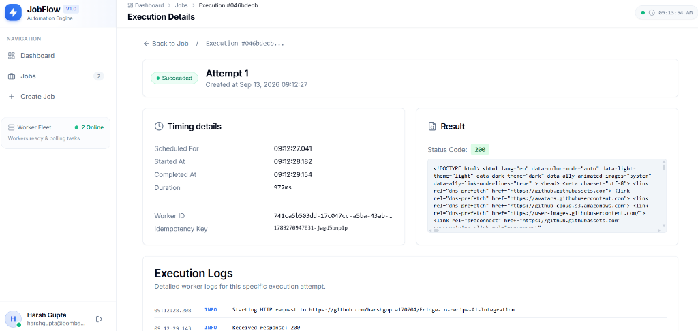

# ⚡ JobFlow — Job Automation Platform

A full-stack job automation platform where users can create, schedule, and monitor automated HTTP jobs with real-time execution tracking, automatic retries, and detailed observability.

Built with **Next.js 14 + React + TypeScript** frontend and **.NET 9 + C# + PostgreSQL** backend.

---

## 📸 Screenshots

### Login


### Dashboard


### Create Job


### Execution Detail


---

## 🏗️ Architecture

```
┌─────────────────┐      ┌─────────────────────┐      ┌──────────────┐
│   Next.js 14    │─────▶│   .NET 9 REST API   │─────▶│  PostgreSQL  │
│   Frontend      │      │   (JWT Auth)         │      │   16         │
│   Port 3000     │      │   Port 8080          │      │   Port 5432  │
└─────────────────┘      └──────────┬──────────┘      └──────┬───────┘
                                    │                         │
                           ┌────────▼────────┐               │
                           │   Job Queue     │◀──────────────┘
                           │  (SKIP LOCKED)  │
                           └────────┬────────┘
                         ┌──────────┼──────────┐
                         ▼          ▼          ▼
                   ┌──────────┐┌──────────┐┌──────────┐
                   │ Worker 1 ││ Worker 2 ││ Worker N │
                   └──────────┘└──────────┘└──────────┘
```

**Key architectural decisions:**
- **DB-backed queue** using PostgreSQL `SELECT FOR UPDATE SKIP LOCKED` — no Redis/RabbitMQ dependency
- **Stateless workers** that can be horizontally scaled via Docker replicas
- **Heartbeat + stale recovery** to detect and retry abandoned jobs
- **Idempotent execution** via client-generated idempotency keys

---

## Live Demo
- **Frontend App**: [https://job-flow-automation-engine.vercel.app](https://job-flow-automation-engine.vercel.app)
- **Backend API**: [https://jobflow-backend-kcw7.onrender.com/swagger](https://jobflow-backend-kcw7.onrender.com/swagger)

---

## ✨ Features

| Feature | Description |
|---------|-------------|
| **Job Management** | Create, edit, pause/resume, delete HTTP request and webhook jobs |
| **Cron Scheduling** | Schedule jobs with standard cron expressions (UTC) |
| **Manual Execution** | One-click "Run Now" with idempotency protection |
| **Automatic Retries** | Exponential backoff (`delay × 2^attempt`), configurable max retries |
| **Concurrent Workers** | SemaphoreSlim(5) per worker, horizontally scalable |
| **Execution History** | Full audit trail with timing, status codes, response bodies |
| **Worker Logs** | Per-execution structured logs with timestamps and levels |
| **Stale Job Recovery** | Auto-detects abandoned jobs (heartbeat > 60s) and retries |
| **Dashboard** | Real-time stats, success rates, worker health, recent executions |
| **Auth** | JWT + bcrypt, per-user job isolation |
| **Optimistic Concurrency** | Version-based conflict detection on job updates |

---

## 🛠️ Tech Stack

| Layer | Technology |
|-------|-----------|
| **Frontend** | Next.js 14, React 18, TypeScript, Tailwind CSS, lucide-react |
| **Backend API** | .NET 9, ASP.NET Core, Entity Framework Core 9 |
| **Workers** | .NET 9 BackgroundService (hosted services) |
| **Database** | PostgreSQL 16 |
| **Auth** | JWT Bearer tokens + bcrypt password hashing |
| **Queue** | PostgreSQL SKIP LOCKED (no external broker) |
| **Containerization** | Docker, Docker Compose |

---

## 🚀 Quick Start

### Prerequisites
- [Docker Desktop](https://www.docker.com/products/docker-desktop/) (v20+)
- [Git](https://git-scm.com/)

### Run with Docker (recommended)

```bash
git clone https://github.com/<your-username>/job-automation-platform.git
cd job-automation-platform
docker compose up --build -d
```

| Service | URL |
|---------|-----|
| **Frontend** | http://localhost:3000 |
| **API** | http://localhost:8080 |
| **Swagger UI** | http://localhost:8080/swagger |

### First Steps
1. Open http://localhost:3000 and click **"Create an account"**
2. Register with your email and a password (min 6 characters)
3. Click **"Create Job"** in the sidebar
4. Enter a name, set type to **HTTP Request**, and enter a URL (e.g., `https://httpbin.org/get`)
5. Click **"Create Job"**, then **"Run Now"**
6. Watch the execution appear on the dashboard with status, duration, and response

---

## 💻 Local Development (without Docker)

### Prerequisites
- [.NET 9 SDK](https://dotnet.microsoft.com/download/dotnet/9.0)
- [Node.js 20+](https://nodejs.org/)
- [PostgreSQL 16](https://www.postgresql.org/download/)

### Setup

```bash
# 1. Start PostgreSQL (or use Docker just for the DB)
docker run -d --name jobplatform-db \
  -e POSTGRES_DB=jobplatform \
  -e POSTGRES_USER=postgres \
  -e POSTGRES_PASSWORD=postgres \
  -p 5432:5432 \
  postgres:16-alpine

# 2. Start the API (Terminal 1)
cd backend
dotnet run --project JobPlatform.Api

# 3. Start the Worker (Terminal 2)
cd backend
dotnet run --project JobPlatform.Worker

# 4. Start the Frontend (Terminal 3)
cd frontend
npm install
npm run dev
```

---

## 🧪 Running Tests

```bash
cd backend
dotnet test --verbosity normal
```

```
Passed!  - Failed: 0, Passed: 9, Skipped: 1, Total: 10
```

| Test | Category |
|------|----------|
| CreateJob valid input | Job CRUD |
| CreateJob computes NextRunAt from cron | Scheduling |
| GetJob wrong user → 404 | Authorization |
| RunJob idempotency deduplication | Idempotency |
| Cancel only Pending/Running executions | State Transitions |
| Retry only Failed/TimedOut executions | State Transitions |
| Retry creates new execution record | Retry Logic |
| HTTP executor returns success on 2xx | Executor |
| HTTP executor returns failure on 5xx | Executor |
| Concurrent dequeue (skipped — needs PostgreSQL) | Concurrency |

**Test focus areas** (per assignment priority):
- Concurrent job execution
- Retries and exponential backoff
- Authorization (per-user isolation)
- State transitions (execution lifecycle)
- Idempotent "Run Now"

---

## 📁 Project Structure

```
├── backend/
│   ├── JobPlatform.Core/           # Domain models, enums, DTOs, interfaces
│   ├── JobPlatform.Infrastructure/  # EF Core, service implementations, queue
│   ├── JobPlatform.Api/            # REST controllers, JWT auth, middleware
│   ├── JobPlatform.Worker/         # Queue processor, scheduler, executors
│   ├── JobPlatform.Tests/          # Unit + integration tests
│   ├── Dockerfile.api              # Multi-stage API container
│   └── Dockerfile.worker           # Multi-stage Worker container
├── frontend/
│   ├── src/
│   │   ├── app/                    # Next.js App Router pages
│   │   ├── components/             # Reusable UI components
│   │   └── lib/                    # API client, auth, utilities
│   └── Dockerfile                  # Multi-stage frontend container
├── docker-compose.yml              # Full stack orchestration
├── ENGINEERING.md                  # Architecture & design decisions
└── README.md                       # This file
```

---

## ⚙️ Environment Variables

| Variable | Default | Description |
|----------|---------|-------------|
| `ConnectionStrings__DefaultConnection` | *(required)* | PostgreSQL connection string |
| `Jwt__Key` | *(required)* | JWT signing key (min 32 chars) |
| `Jwt__Issuer` | `JobPlatform` | JWT issuer |
| `Jwt__Audience` | `JobPlatform` | JWT audience |
| `ASPNETCORE_URLS` | `http://+:8080` | API listen address |
| `NEXT_PUBLIC_API_URL` | `http://localhost:8080` | Backend API URL for frontend |

See [`.env.example`](.env.example) for a complete template.

---

## 📊 API Endpoints

### Auth
| Method | Endpoint | Description |
|--------|----------|-------------|
| POST | `/api/auth/register` | Create account |
| POST | `/api/auth/login` | Get JWT token |
| GET | `/api/auth/me` | Current user info |

### Jobs
| Method | Endpoint | Description |
|--------|----------|-------------|
| GET | `/api/jobs` | List jobs (with search, filter, pagination) |
| GET | `/api/jobs/{id}` | Get job details |
| POST | `/api/jobs` | Create job |
| PUT | `/api/jobs/{id}` | Update job |
| DELETE | `/api/jobs/{id}` | Delete job |
| POST | `/api/jobs/{id}/toggle` | Pause/resume job |
| POST | `/api/jobs/{id}/run` | Trigger manual execution |

### Executions
| Method | Endpoint | Description |
|--------|----------|-------------|
| GET | `/api/jobs/{jobId}/executions` | List executions for a job |
| GET | `/api/executions/{id}` | Get execution detail with logs |
| POST | `/api/executions/{id}/cancel` | Cancel a running execution |
| POST | `/api/executions/{id}/retry` | Retry a failed execution |

### Dashboard
| Method | Endpoint | Description |
|--------|----------|-------------|
| GET | `/api/dashboard/stats` | Aggregated statistics |
| GET | `/api/dashboard/recent` | Recent executions across all jobs |

Full interactive docs available at **http://localhost:8080/swagger**

---

## 🔧 Key Engineering Decisions

For a deep dive into architecture, trade-offs, and design rationale, see [**ENGINEERING.md**](ENGINEERING.md).

Highlights:
- **Why PostgreSQL SKIP LOCKED over Redis/RabbitMQ?** — Simpler ops, transactional consistency, no extra infrastructure
- **Why separate Execution records per retry?** — Full audit trail, no data loss
- **Why exponential backoff?** — Prevents thundering herd on transient failures
- **Why SemaphoreSlim over Task.WhenAll?** — Bounded concurrency prevents worker overload
- **Why Version concurrency token?** — Prevents conflicting job updates without pessimistic locking

---

## 📋 Known Limitations

- **HTTP/Webhook only** — Script and DataSync job types are stubbed for future development
- **No DAG support** — Jobs are independent; no task chaining or dependency graphs
- **No WebSocket** — Dashboard polls every 30s; real-time push would improve UX
- **Single-region** — No multi-region queue partitioning
- **No rate limiting** — API endpoints lack request throttling

---

## 📄 License

MIT
